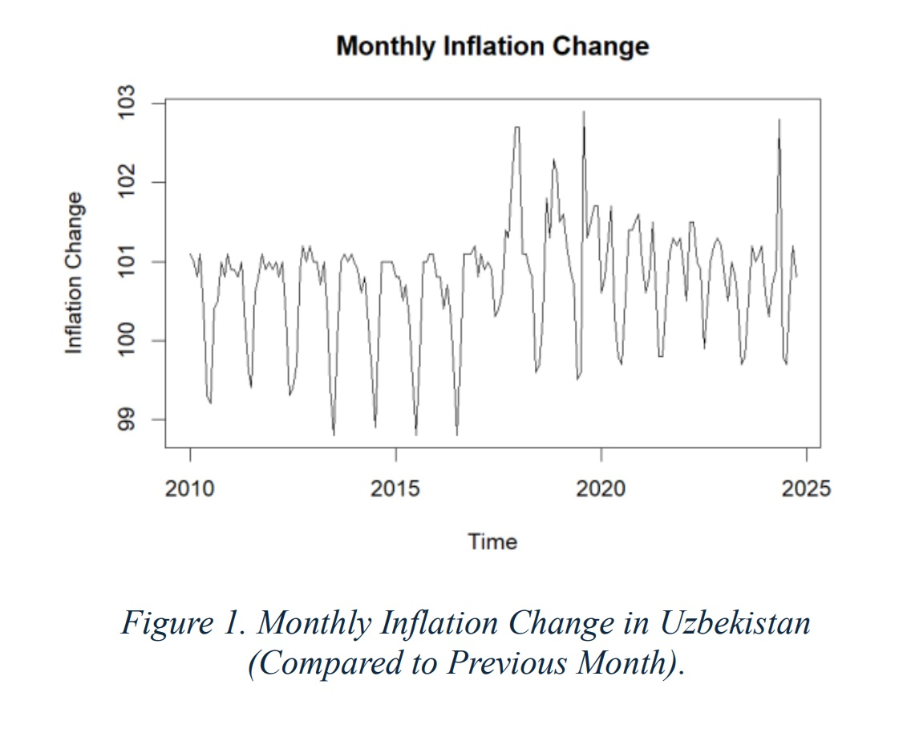
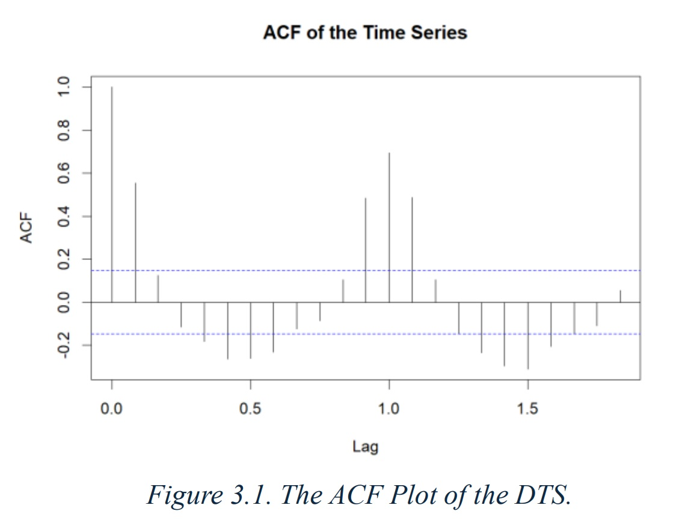
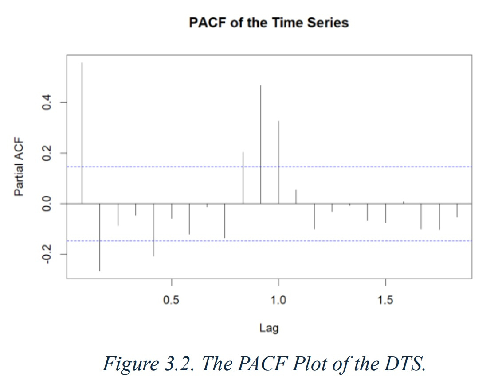
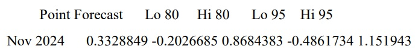

# UZ_Inflation - Time Series Analysis of Uzbekistan's Inflation

This project applies statistical techniques and time series modelling to analyse monthly inflation levels in Uzbekistan over the past 15 years, and to forecast future levels of inflation. The data was obtained from the official website of the Government of Uzbekistan. The study explores the statistical properties of the series, tests for stationarity and normality, and fits a SARIMA model for forecasting future inflation levels.

<br>

## 📈 Project Overview

**Dataset:** Monthly inflation rate in Uzbekistan (Jan 2010 - Oct 2024)  
**Programming Language:** R, 
**Libraries:** ```quantmod```, ```fpp```, ```forecast```, ```tseries```  
**Statistical Tests:** ADF, Ljung-Box, Shapiro-Wilk  
**Methods Applied:**  
- Detrending via linear regression
- ACF & PACF diagnostics
- Ljung-Box test for autocorrelation
- Augmented Dickey-Fuller (ADF) & KPSS tests for stationarity
- Normality tests: Lilliefors, Anderson-Darling, Shapiro-Francia
- SARIMA modelling with manual selection and auto.arima comparison
- Residual diagnostics (mean, variance, autocorrelation)

<br>

## 🔄 Workflow
1. Obtain the time series.
2. Detrend the series.
3. Create ACF & PACF. Determine if it is a unit root.
4. Check for autocorrelation.
5. Check for stationarity.
6. Normality tests (Kolmogoros-Smirnov, Anderson-Darling, Shapiro-Francia).
7. Fit an ARMA model & determine the best lag.
8. Make a 1-step forecast.
9. Check the ARMA model fits the series well (residuals have zero mean and autocovariance, finite and constant variance).

<br>

## 📊 Outputs
### Inflation Time Series



<br>

### ACF Plot



<br>

### PACF Plot



<br>

### 1-Step Ahead Forecast



<br>


## ⚙️ How to Run
Want to reproduce the analysis and forecasts yourself? Follow these steps to run the code:
1. Clone the repository:
   ```
   git clone https://github.com/Arslan2003/Uz_Inflation.git
   cd Uz_Inflation
   ```
2. Ensure your files are in place:  
   ```Uz_Inflation.R``` - the main R script containing the code.  
   ```Uzb_monthly_inflation.csv``` - dataset of monthly inflation changes.   
3. Install required R packages:
   Uncomment this line in the code file by removing the ```#```
   ```
   # install.packages(c(zoo", "fpp", "forecast", "tseries", "lmtest", "nortest"))
   ```
4. Run the R script:
   Open R or RStudio, and run:
   ```
   source("Uz_Inflation.R")
   ```
5. Experiment!

<br>

## 🤝 Contributions
This project can be used to practice using the tools or applying the methods listed above. If you are looking to contribute to the project, I will be happy to collaborate! Here are a few ideas to get you started on how you could contribute to this project:
- Extend to **SARIMA** for seasonality modelling.
- Compare with Machine Learning models (e.g., LSTM).
- Broaden the dataset to include other macroeconomic indicators.

<br>


## 🧑‍💻 Author
[Arslonbek Ishanov](https://github.com/Arslan2003) - First-Class Data Science Graduate.

<br>


## ⚖️ License

This project is licensed under the MIT License.  
See the [LICENSE](LICENSE) file for full terms.

<br>


## 📚 References

- Dataset: [National Statistics Committee of the Republic of Uzbekistan](https://stat.uz/en/).
- Adhikari, R., & Agrawal, R. K. (2013). *Forecasting strong seasonal time series with ARIMA*. Computational Statistics & Data Analysis, 61, 157–168.
- Frain, J. (1992). *Time Series Analysis in Econometrics*. Springer.

<br>


🏷️ Tags
--------

`R` `Time-Series` `Statistics` `Econometrics` `ARMA` `Uzbekistan` `Inflation` `Forecasting`


